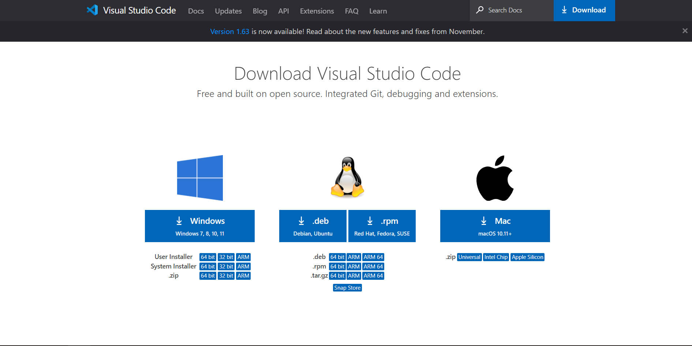
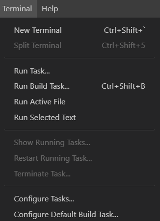
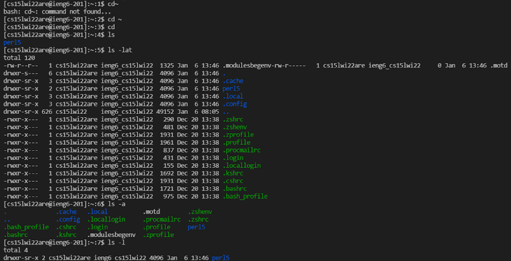
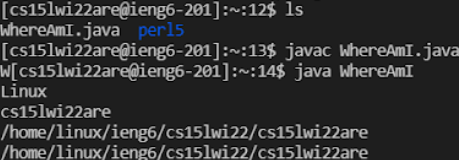
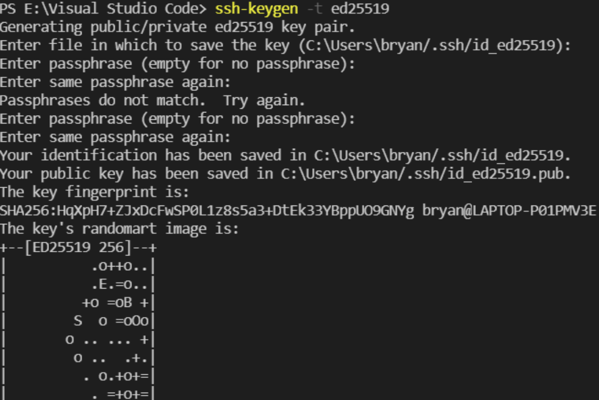
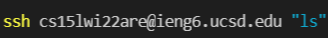
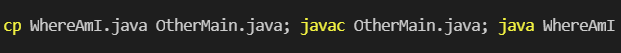

# Remote Access
by Bryan Budiputra, CSE15L

Welcome! In this step-by-step tutorial blogpost, we will learn how to **remotely access** UCSD's ieng6. Here, we will go over the following steps: 
* Installing Visual Studio Code
* Remotely Connecting
* Trying Some Commands
* Moving Files with `scp`
* Setting an SSH Key
* Optimizing Remote Running
---
> ## Installing Visual Studio Code
1. Go to the [Visual Studio Code](https://code.visualstudio.com/) website and click on the "Download" button on the top right corner.
2. Download the installer that is suitable for your current operating system.

3. Run the `.exe` installer from your downloads folder.


4. Follow the instructions prompted on your screen until you find an "Install" button. Click the "Install" button to start the software installation.
5. Once finished, the software is installed and ready to use. Click "Finish" to finalize the installation and start the program.
---
> ## Remotely Connecting
1. If you're on Windows: install a program called [OpenSSH](https://docs.microsoft.com/en-us/windows-server/administration/openssh/openssh_install_firstuse), which is a program that can connect your computer to other computers that have this kind of account.
2. Look up your specific account for CSE15L [here](https://sdacs.ucsd.edu/~icc/index.php).
3. In VScode, open a terminal using `Ctrl`/`Command` + \`, or use the Terminal → New Terminal menu option.



4. Enter the following command, but with your account where the "zz" is replaced by the letters in your course-specific account: `ssh cs15lwi22zz@ieng6.ucsd.edu`
5. If it is your first time connecting to the server, you will probably get a message like this:
```
⤇ ssh cs15lwi22zz@ieng6.ucsd.edu
The authenticity of host 'ieng6.ucsd.edu (128.54.70.227)' can't be established.
RSA key fingerprint is SHA256:ksruYwhnYH+sySHnHAtLUHngrPEyZTDl/1x99wUQcec.
Are you sure you want to continue connecting (yes/no/[fingerprint])? 
```
6. Type "yes" and press enter, then type in your password. The password you type will not appear on the terminal for your safety, so please type the whole password as you usually would. If you entered the password correctly, you will receive a message like this:
```
⤇ ssh cs15lwi22zz@ieng6.ucsd.edu
The authenticity of host 'ieng6-202.ucsd.edu (128.54.70.227)' can't be established.
RSA key fingerprint is SHA256:ksruYwhnYH+sySHnHAtLUHngrPEyZTDl/1x99wUQcec.
Are you sure you want to continue connecting (yes/no/[fingerprint])? 
Password: 
Last login: Sun Jan  2 14:03:05 2022 from 107-217-10-235.lightspeed.sndgca.sbcglobal.net
quota: No filesystem specified.
Hello cs15lwi22zz, you are currently logged into ieng6-203.ucsd.edu

You are using 0% CPU on this system

Cluster Status 
Hostname     Time    #Users  Load  Averages  
ieng6-201   23:25:01   0  0.08,  0.17,  0.11
ieng6-202   23:25:01   1  0.09,  0.15,  0.11
ieng6-203   23:25:01   1  0.08,  0.15,  0.11

Sun Jan 02, 2022 11:28pm - Prepping cs15lwi22
```
7. Now your terminal is connected to a computer in UCSD's CSE basement, and any commands you run will run on that computer!
---
> ## Trying Some Commands
Try running some commands a few times in different ways, both on your computer and on the remote computer. Here are some common commands:
* `cd`
* `cd ~`
* `ls`
* `ls -lat` ⤇ try out different combinations of "l", "a", and "t"
* `pwd`
* `mkdir`
* `cp`

Hint: To log out of the remote server in your terminal, you can use:
* Ctrl-D
* Run the command `exit`

Here is an example of the terminal with the commands:


---
> ## Moving Files with `scp`
One key step in working remotely is being able to copy files back and forth between the client and the server. A command called `scp`, which stands for *secure copy*, can be used to do so. Let's try it out!

1. Create a file on your computer called `WhereAmI.java` and put the following contents into it:
```
class WhereAmI {
  public static void main(String[] args) {
    System.out.println(System.getProperty("os.name"));
    System.out.println(System.getProperty("user.name"));
    System.out.println(System.getProperty("user.home"));
    System.out.println(System.getProperty("user.dir"));
  }
}
```
2. Run it using javac and java on your computer. Observe the output.
3. Now, in the terminal from the directory where you made this file, run this command with your course-specific account: `scp WhereAmI.java cs15lwi22zz@ieng6.ucsd.edu:~/`
4. You should be prompted to enter your password.
5. Then, log into ieng6 with ssh again, and use the `ls` command. You should see the file there in your home directory! Now you can run it on the ieng6 computer using javac and java. 


---
> ## Setting an SSH Key
The idea behind ssh keys is that a program, called ssh-keygen, creates a pair of files called the public key and private key. You copy the public key to a particular location on the server, and the private key in a particular location on the client. Then, the ssh command can use the pair of files in place of your password.

1. On your computer, run the following command in the terminal: `ssh-keygen -t ed25519`
2. For the next three lines, you can type in your own choice of the file to save the key and passphrases. To save it as default, press "Enter".
3. It should look something like this:



4. This created two new files on your system; the private key (in a file `id_ed25519`) and the public key (in a file `id_ed25519.pub`), stored in the .ssh directory on your computer.
5. Now we need to copy the public (not the private) key to the `.ssh` directory of your user account on the server. Run the `ssh` command with your user-specific account (`scp cs15lwi22zz@ieng6.ucsd.edu:~/`) and enter your password.
6. Run the command `mkdir .ssh` on the server. Then `exit`.
7. On the client, run the command `scp <path> <user-specific account>.ssh/authorized_keys`. Replace the text in `<>` with your own path and account.
8. Once you do this, you should be able to `ssh` or `scp` from this client to the server without entering your password.
---
> ## Optimizing Remote Running
Use what you’ve learned to come up with the most pleasant process you can for making a local edit to WhereAmI.java, then copying it to the remote server and running it.

Some hints:
* You can write a command in quotes at the end of an ssh command to directly run it on the remote server, then exit. For example, this command will log in and list the home directory on the remote server:



* You can use semicolons to run multiple commands on the same line in most terminals. For example:



* You can use the up-arrow on your keyboard to recall the last command that was run
---
> ## Congratulations!
<<<<<<< HEAD
You have finished the basics of remotely accessing UCSD's ieng6 servers!
=======
You have finished the basics of remotely accessing UCSD's ieng6 servers!
>>>>>>> ff43afc2c541e9e6bc4bf480e13470b532e3aa0b
