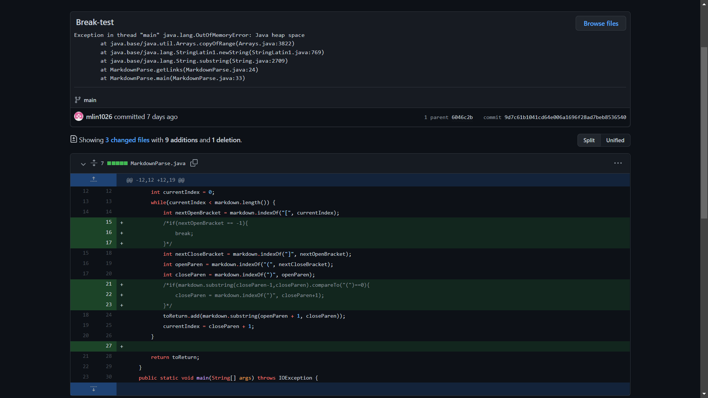
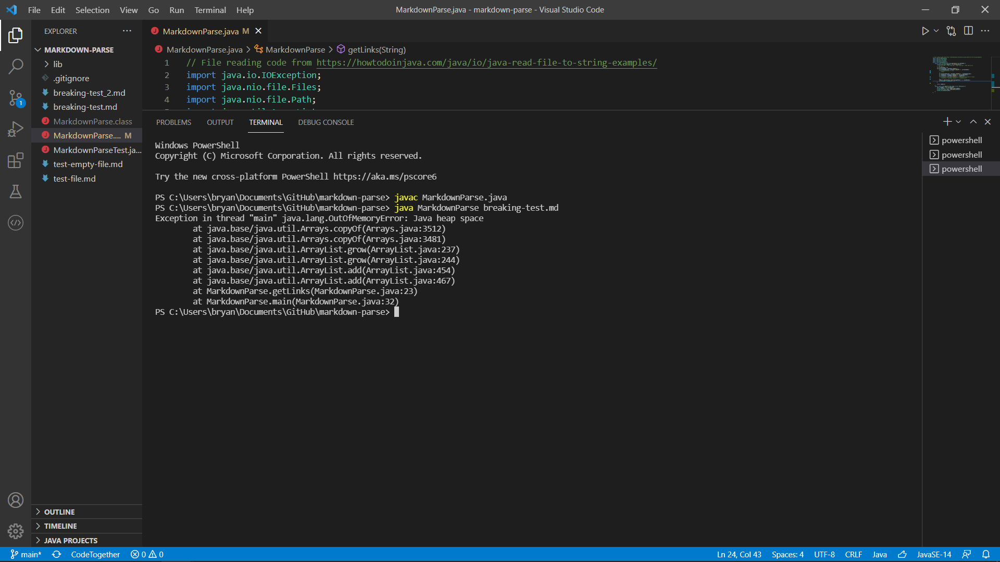
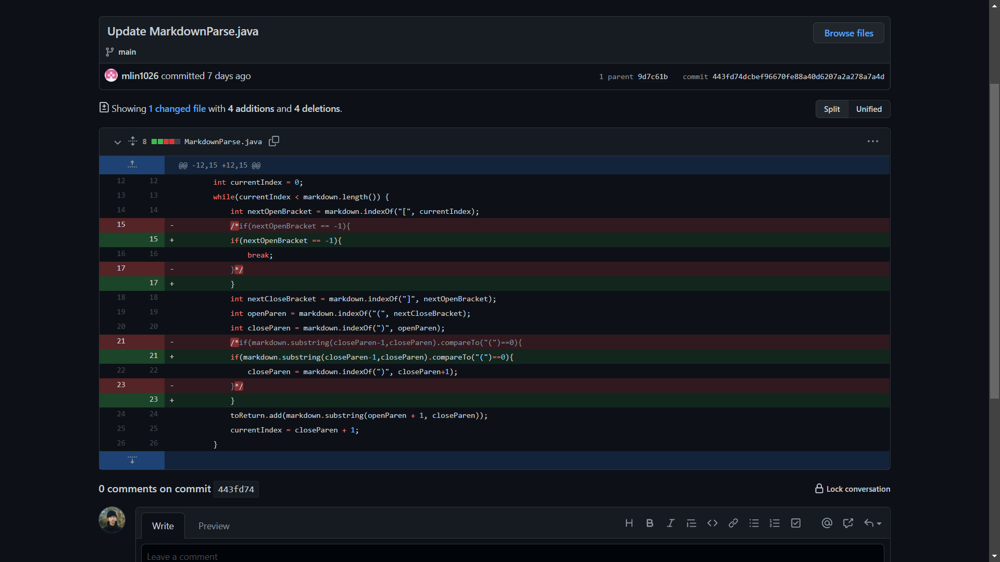
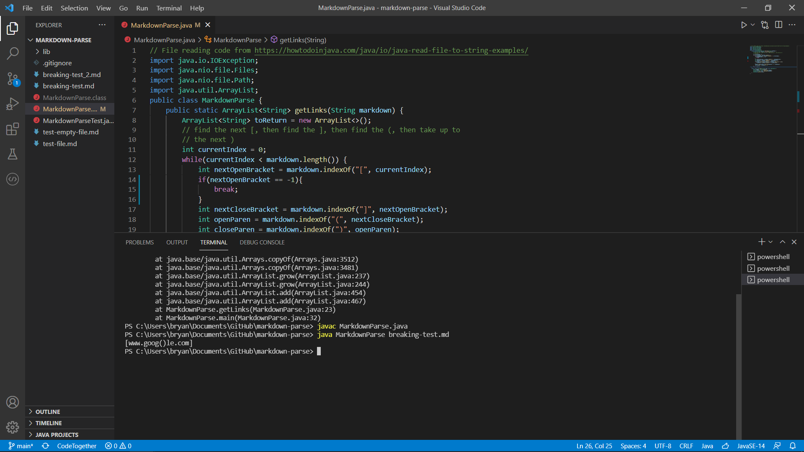
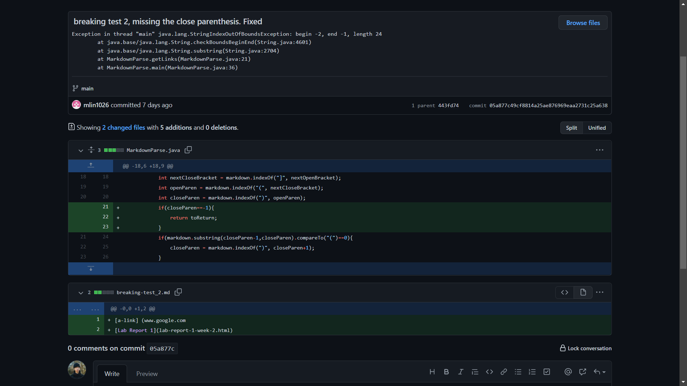
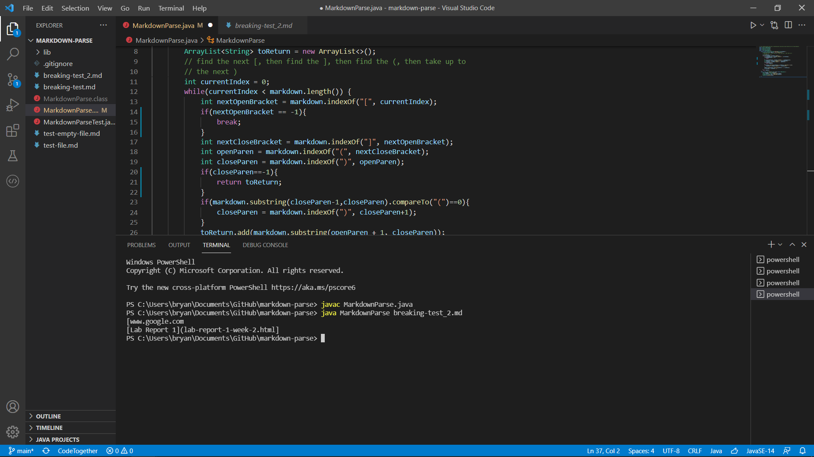

# Relationship between bugs, symptoms, and failure-inducing input
by Bryan Budiputra, CSE15L

## Observation 1

* Here is a screenshot of the first code change difference from Github.

* Here is the link to the test file for a _failure-inducing input_: [breaking-test.md](https://github.com/Bryan-MB/markdown-parse/blob/main/breaking-test.md).

* Here is the _symptom_ of that _failure-inducing input_ from running the file at the command-line for the version where it was failing.

### Relationship
MarkdownParse.java contains a while loop, that loops until the end of the file, to parse links found between parentheses. We observed a symptom when we tested the program with a _failure-inducing input_, a pair of misplaced parentheses, which caused an infinite loop. Therefore, we concluded that the bug in the program was the condition within the while loop.

## Observation 2

* Here is a screenshot of the second code change difference from Github.

* Here is the link to the test file for a _failure-inducing input_: [breaking-test.md](https://github.com/Bryan-MB/markdown-parse/blob/main/breaking-test.md).

* Here, we made changes to the program to fix the _symptom_ we observed in _Observation 1_. In this version, the program was able to sucessfully parse the link.

### Relationship
To fix the bug earlier, we created an ``if`` statement to check whether there was a pair of misplaced parentheses within the link in the file. If so, the program should continue reading in the contents until the end of the file.

## Observation 3

* Here is a screenshot of the third code change difference from Github.

* Here is the link to another test file for a _failure-inducing input_: [breaking-test_2.md](https://github.com/Bryan-MB/markdown-parse/blob/main/breaking-test_2.md).

* Here is the _symptom_ of that _failure-inducing input_ from running the file at the command-line for the version where it was failing.

* Here, the _symptom_ was caused due to a missing closing parenthesis and followed by another link in the next line. The program was able to continue reading onto the next line to read the second link, but also read in the link title in the output.

### Relationship
We observed a _symptom_ in the print output because the program also included the link title and an open parenthesis: ``[Lab Report 1](``. This was caused by a bug in the program found within the while loop for parsing the links incorrectly. The correct output we expect is ``[www.google.com, lab-report-1-week-2.html]``.