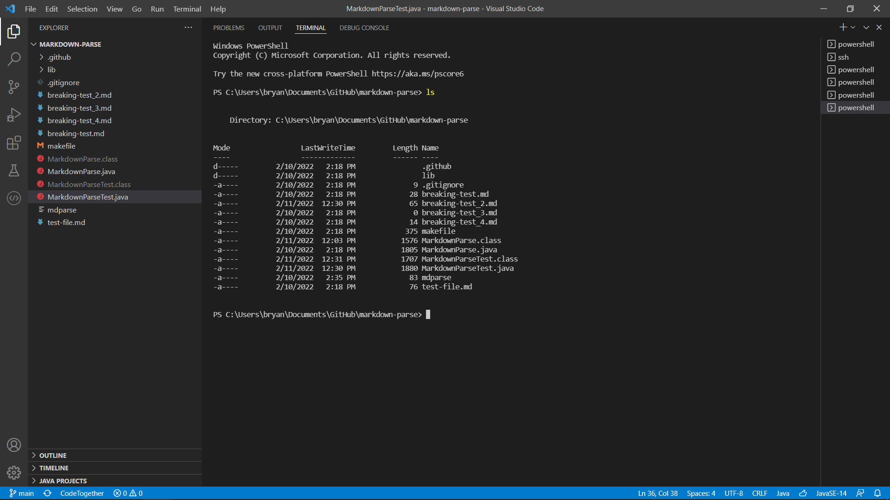
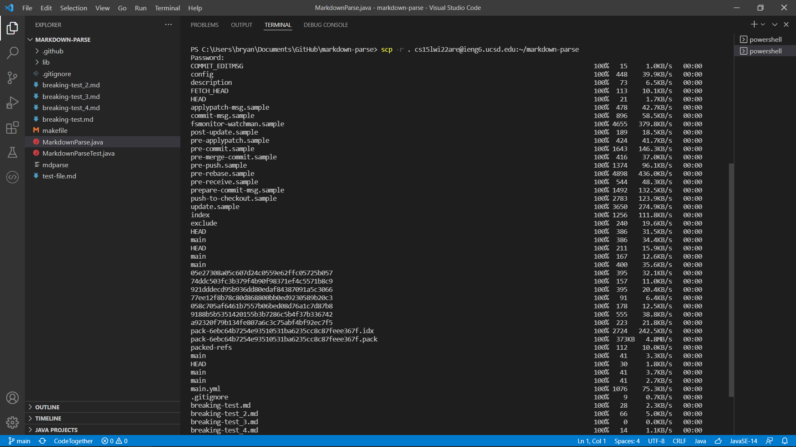
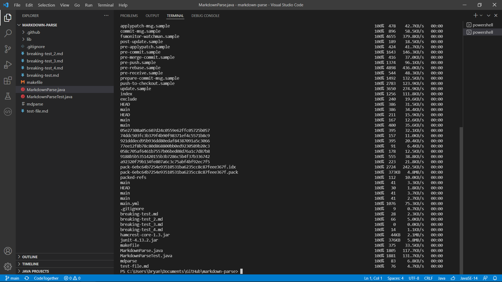
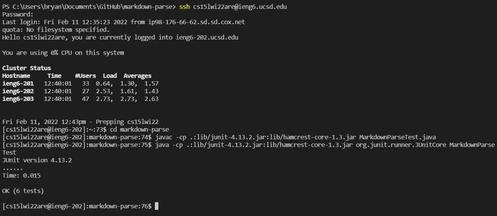
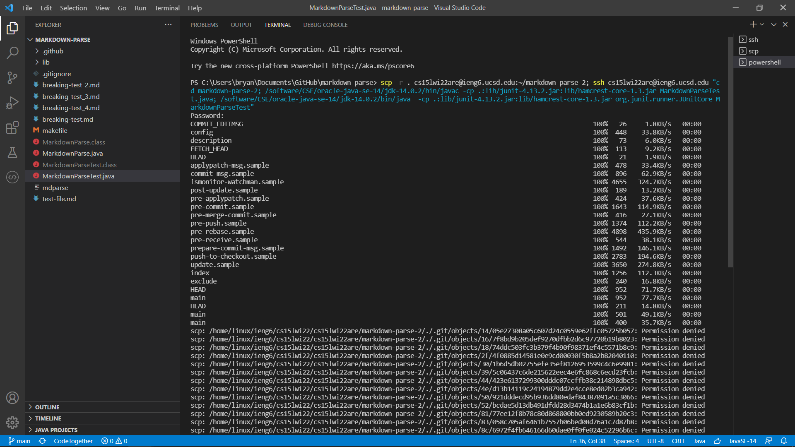
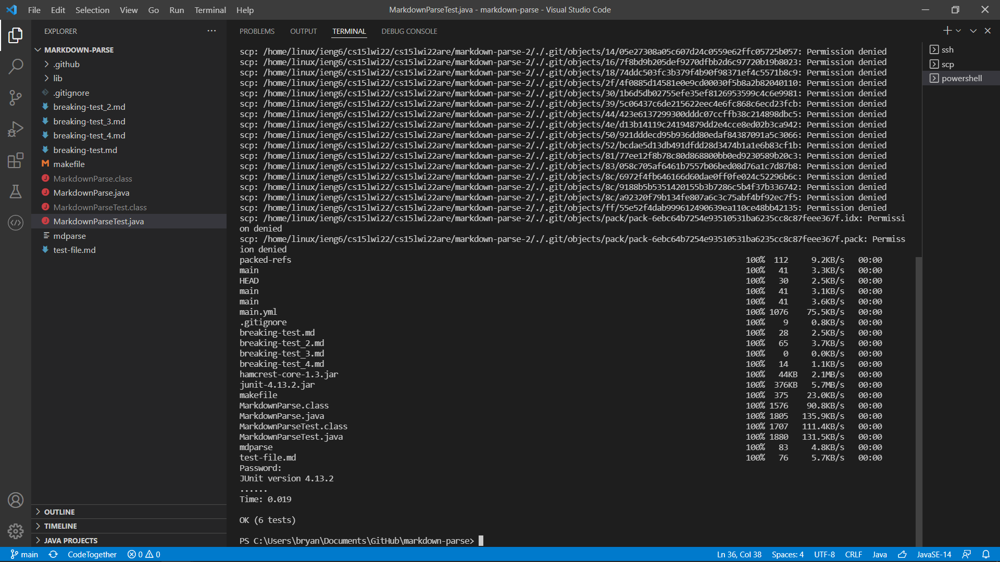

# Copy Whole Directories with `scp -r`
by Bryan Budiputra, CSE15L

Using the command `ls`, we can see the all the files in the local machine.



Now we want to copy the whole markdown-parse directory to the ieng6 account. To do this, we can use the following command:

```scp -r . cs15lwi22@ieng6.ucsd.edu:~/markdown-parse```





To show this works, we will compile and run the files in the remote server.



We have successfully copied a whole directory to a remote server!

However, we can still optimize this system by using only one command-line to do all of the above.

We can write a command in quotes at the end of an `ssh` command to directly run it on the remote server, then exit. We can also use semicolons to run multiple commands on the same line. Combining both of these, we can do the following:



