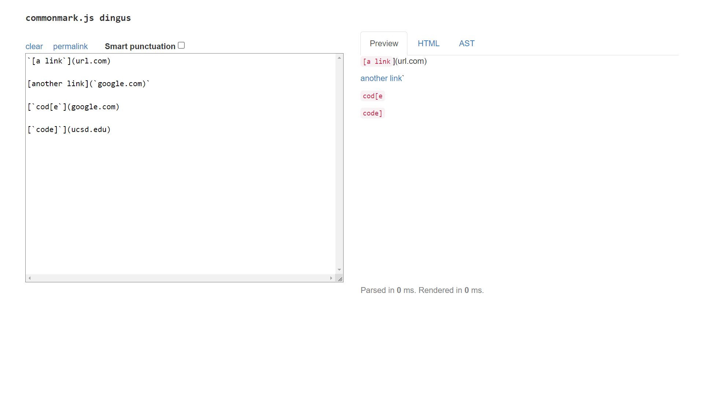
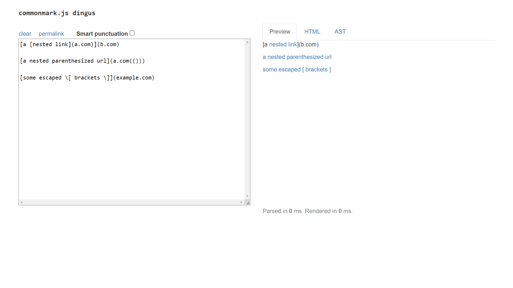
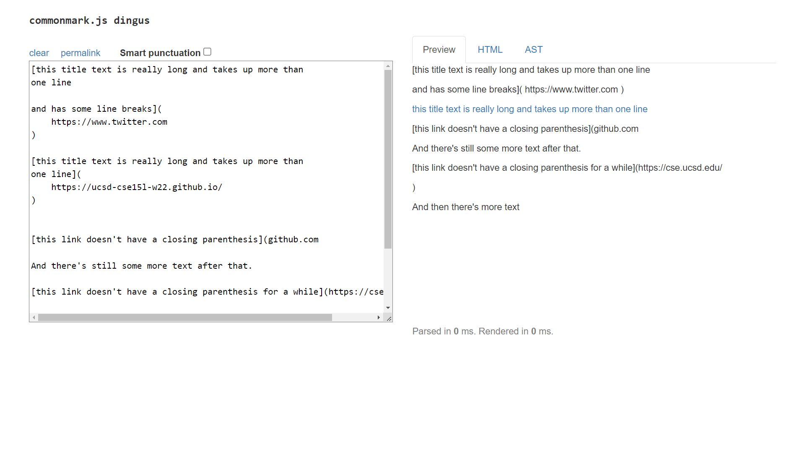
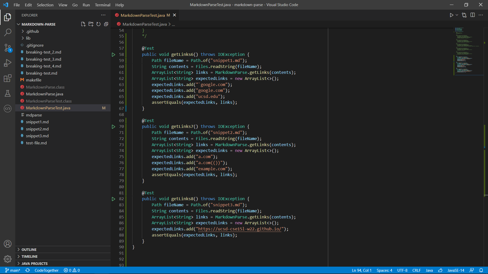
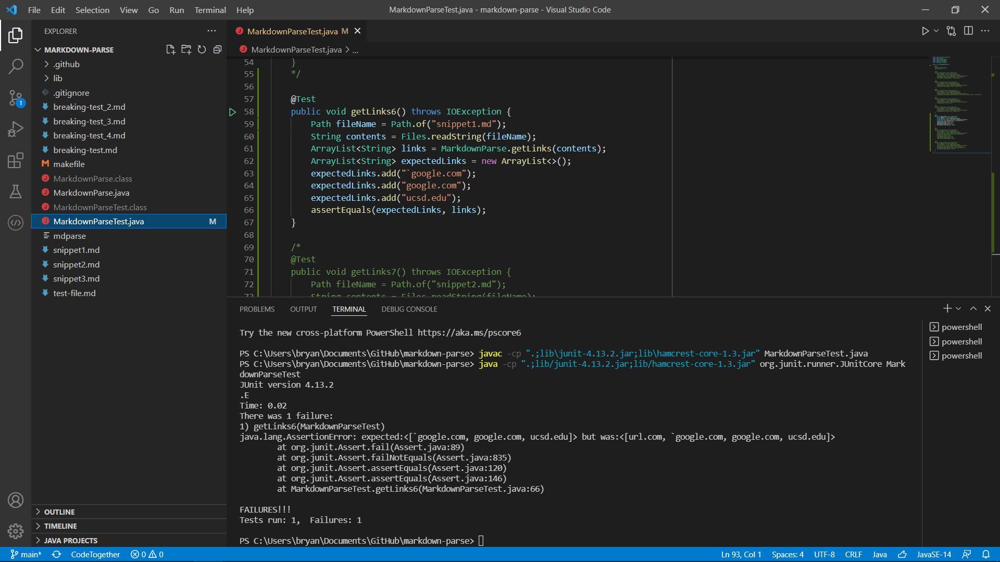
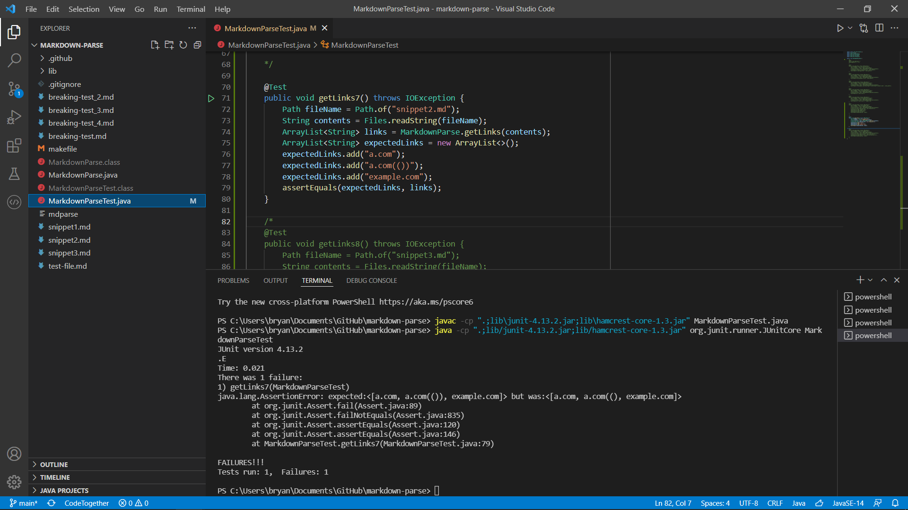
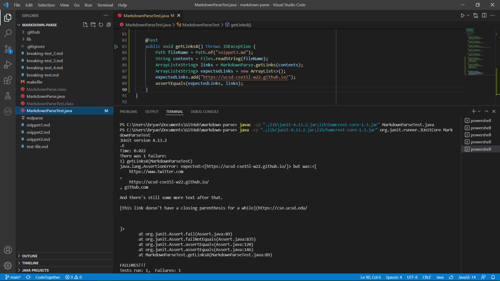

# Debugging Markdown Snippets
by Bryan Budiputra, CSE15L

We will be testing three markdown snippets on my group's implementation of markdown-parse and on another group's implementation of markdown-parse.

According to [Common Mark demo site](https://spec.commonmark.org/dingus/),

* Snippet 1 should produce `[google.com, google.com, ucsd.edu]`
    
* Snippet 2 should produce `[a.com, a.com(()), example.com]`
    
* Snippet 3 should produce `[https://ucsd-cse15l-w22.github.io/]`
    

## JUnit Tests for the Snippets

## Output from Running Snippet 1
* On my group's implementation of markdown-parse, we observed that it did not pass.
    

* On the other group's implementation of markdown-parse, we observed that it 

## Output from Running Snippet 2
* On my group's implementation of markdown-parse, we observed that it did not pass.
    

* On the other group's implementation of markdown-parse, we observed that it 

## Output from Running Snippet 3
* On my group's implementation of markdown-parse, we observed that it did not pass.
    

* On the other group's implementation of markdown-parse, we observed that it 

## Debugging Snippet 1
Yes, I think there is a small code change that will make the program work for snippet 1. Comparing the expected output and the actual output, the program has successfully read 3 of the correct links. However, it also read the invalid link `url.com`. We can debug this by letting the program know that it is an invalid link if there are backticks in the link name.

## Debugging Snippet 2
Yes, I think there is a small code change that will make the program work for snippet 2. Comparing the expected output and the actual output, the program has successfully read all 3 of the correct links. However, it failed to read an extra closing bracket `)`. We can debug this by letting the program know that it should read the whole link until the last closing bracket.

## Debugging Snippet 3
No, I think there would be a more involved change required to make the program work for snippet 3. Comparing the expected output and the actual output, the program failed to read the valid link and instead read almost the whole snippet 3. It failed because it could not find the closing bracket `)` to read in one link, then continued to look for it until the end of the file. We can debug this by letting the program know that it should only read links in each line and stop if there is no closing bracket in that line.