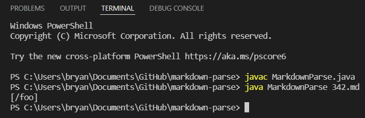
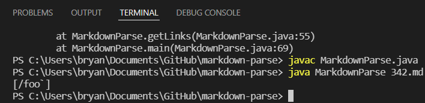

# Debugging the Difference Between Running Two MarkdownParse on Two Test Files
By Bryan Budiputra, CSE15L

Here we have the two tests we will be testing on.

The first test is test #194:

The second test is test #342:

## Testing the First Test
Now, we will run my implementation of MarkdownParse on the first test. Here is the result:

Now, we will run the Professor's implementation of MarkdownParse on the first test. Here is the result:

### Observing the Difference
We can see here that both MarkdownParse files produced two different outputs. My group's implementation of MarkdownParse failed to parse the link and instead, ran into an infinite loop. In comparison, the Professor's implementation of MarkdownParse ran successfully and parsed `url`, which is the correct link. Therefore, the second run was correct. 

### The Problem in the Wrong Code
Since we know the program ran into an infinite loop, we can find out where the infinite loop is happening by simply using `System.out.println()` at the start of the loop. Using this method, we noticed that the program is constantly looking for an open parenthesis in index 20 of test #194. 

A fix for this problem would be to tell the program that it should look for the open parenthesis intead, starting in line 25.

## Testing the Second Test
Now, we will run my implementation of MarkdownParse on the second test. Here is the result:

Now, we will run the Professor's implementation of MarkdownParse on the second test. Here is the result:

### Observing the Difference
We can see here that both MarkdownParse files produced two almost similar outputs. The only difference is that my group's implementation of MarkdownParse did not add the back tick, thus, we get `/foo`. In comparison, the Professor's implementation of MarkdownParse read the whole link which is `/foo`\`. From looking at the raw code in 342.md, the back tick should be ignored and not added to the parsing of the link. Also, links do not usually have back ticks. Therefore, my group's implementation of MarkdownParse is correct.

### The Problem in the Wrong Code
The problem here is not too bad because it is reading in the backtick. Instead, the program should have a condition that if a back tick is read, then we should not add it into the parsing. So, we can add the following block of code in the wrong code to ignore that back tick.
